<p align="center">
  
</p>

<h1 align="center">Markdown Previewer</h1>

A browser-based Markdown reader and editor. Open a Markdown file or choose a folder to browse, search, preview, and edit your documents. Files stay on your device; the app does not upload them.

<details>
<summary>View screenshots</summary>

| Feature | Dark theme | Light theme |
| :--- | :--- | :--- |
| Home & recents | 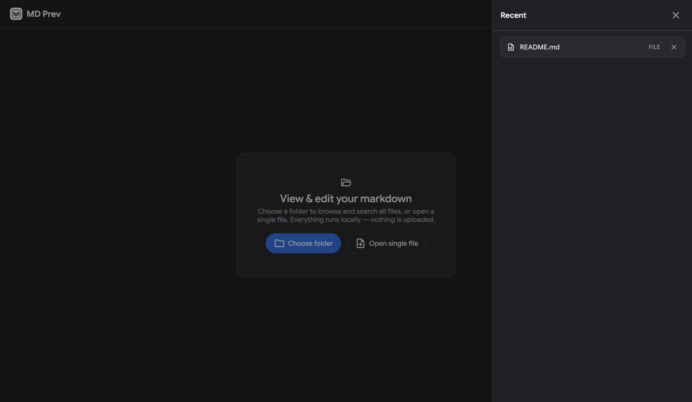 | 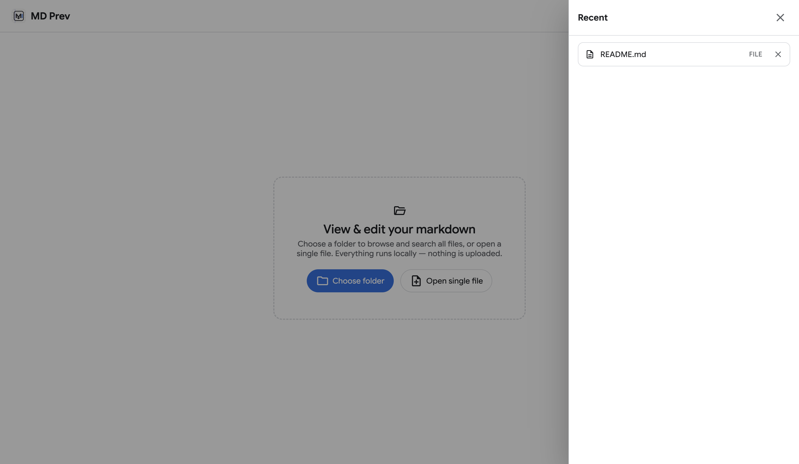 |
| Markdown preview | 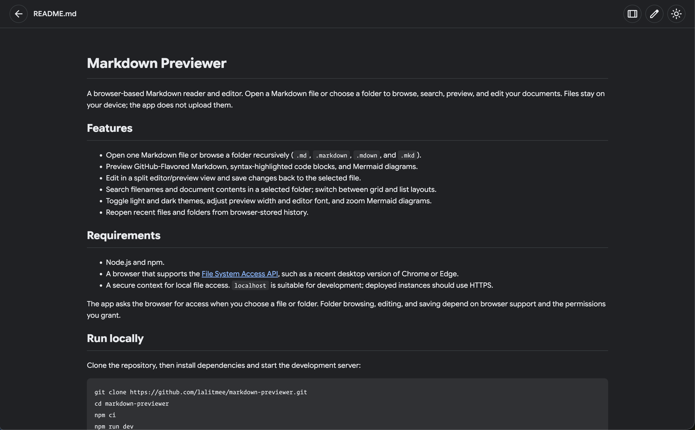 | 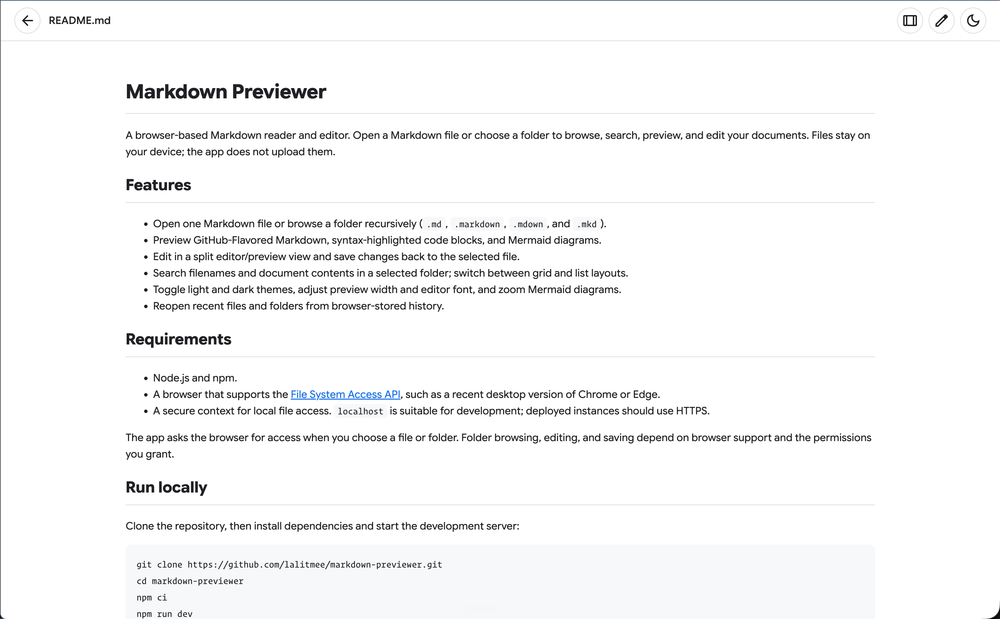 |
| Content search | 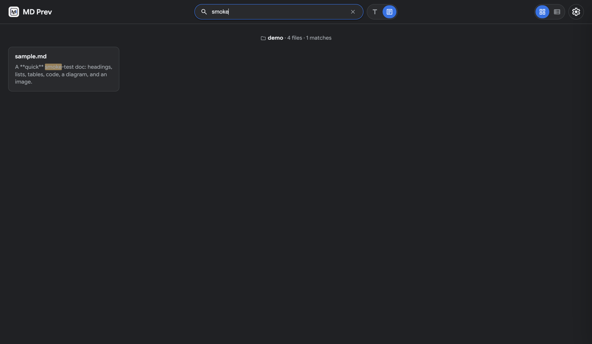 | 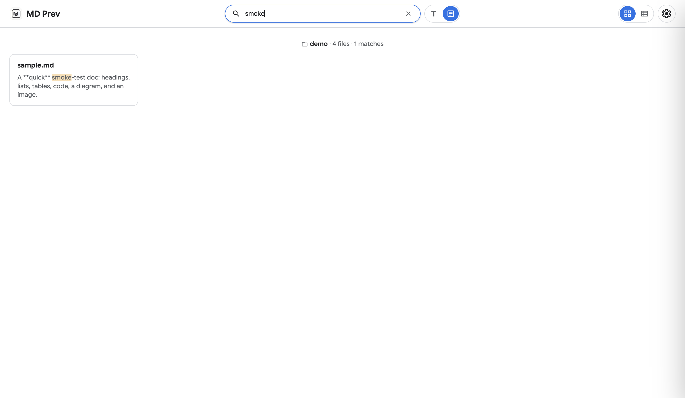 |
| Mermaid diagrams | 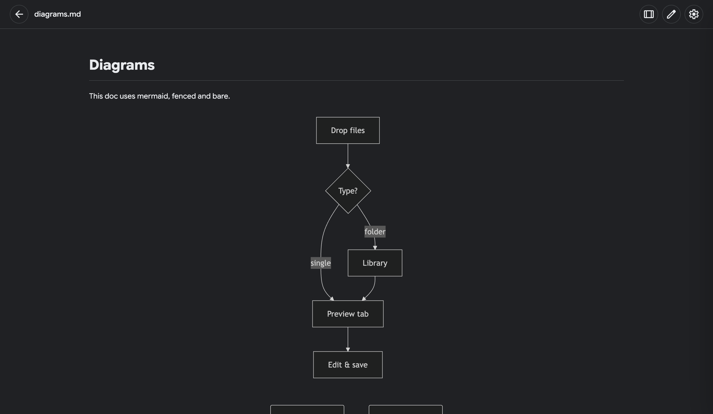 | 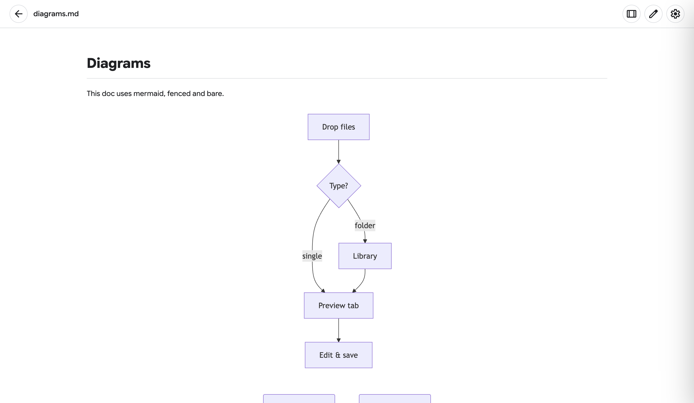 |
| Split editing | 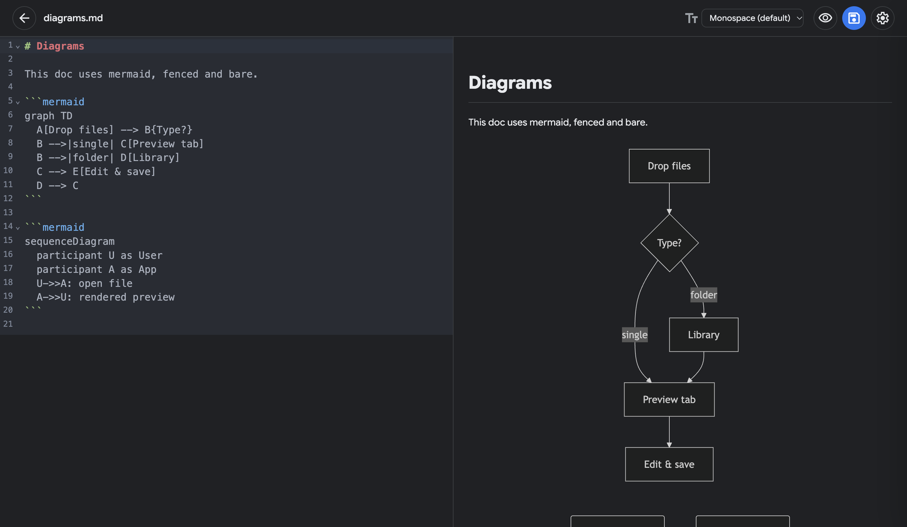 | 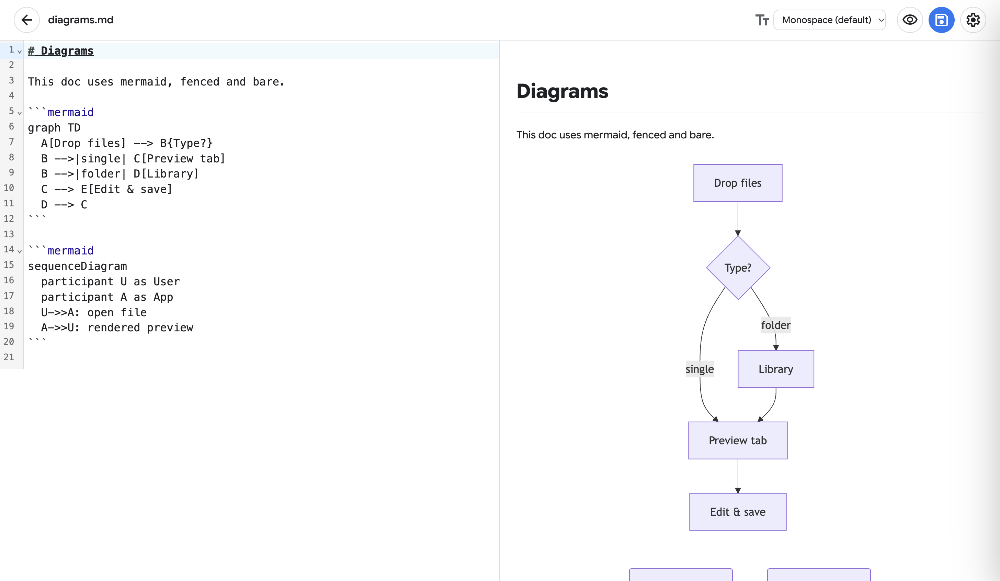 |
| Folder views (grid) | 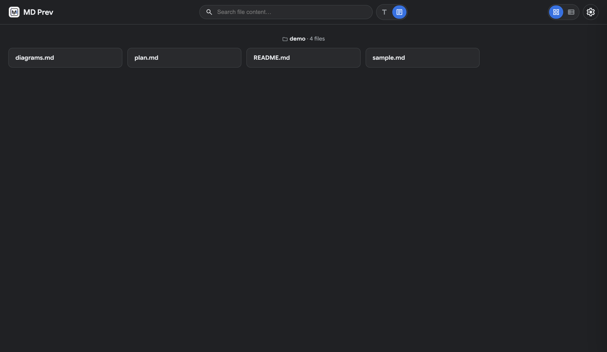 | 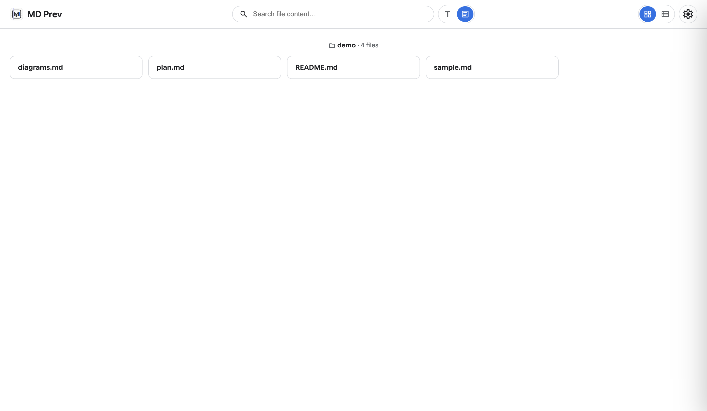 |
| Folder views (list) | 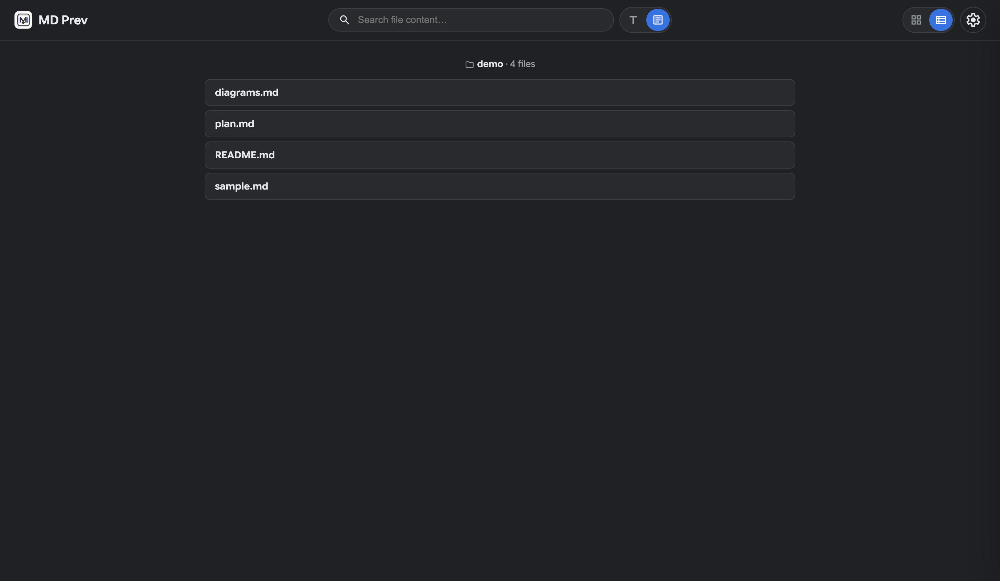 | 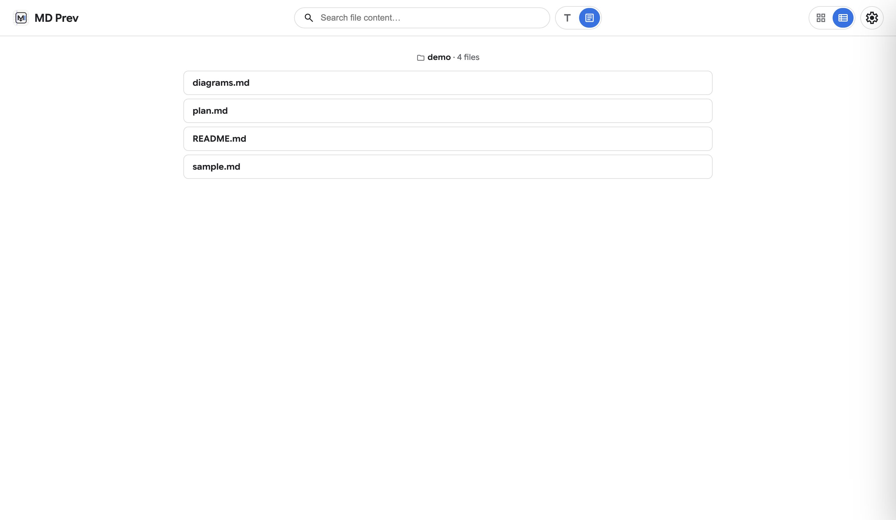 |

</details>

## Features

### Read & browse

- Open a single Markdown file or a whole folder, browsed recursively (`.md`, `.markdown`, `.mdown`, and `.mkd`).
- Browse in grid or list view; files with duplicate names show a folder path to tell them apart.
- Search filenames or document contents, with matching-line snippets and highlighted matches.
- Hide files and folders by name or regex patterns (`node_modules` and `.git` excluded by default), configurable in Settings.

### Preview & edit

- GitHub-Flavored Markdown with syntax-highlighted code blocks.
- Mermaid diagrams — fenced, bare, or inside unlabeled code fences — that follow the active theme; click any diagram to zoom it.
- Relative image references (e.g. ``) resolve against the containing folder, so local images render without a server.
- Cursor-style plan documents (`name` / `overview` / `todos` with status) render as a styled checklist.
- Split editor/preview editing with 10 editor fonts; save changes back to the original file.

### Personalize

- System, light, or dark theme.
- Accent color from presets or a free color picker, and an adjustable preview width.

### Privacy & security

- Files are read and edited locally through browser file handles — nothing is uploaded.
- Rendered documents are sanitized against embedded scripts (XSS).

## Use the app

1. Choose **Open single file** to preview one Markdown document, or **Choose folder** to browse a directory and its subdirectories.
2. Select a document to preview it. In a folder library, use the search field to find text in filenames or document contents (content matches show a snippet of the line).
3. Use the edit/preview control to switch to a split editor and preview. Select **Save** to write changes to the original file when the browser grants write access.
4. Use the toolbar to switch between preview and edit modes, change library layout, editor font, or preview width. Choose a theme and accent color in Settings. Click Mermaid diagrams to zoom them.

## Requirements

- Node.js and npm.
- A browser that supports the [File System Access API](https://developer.mozilla.org/en-US/docs/Web/API/File_System_Access_API), such as a recent desktop version of Chrome or Edge.
- A secure context for local file access. `localhost` is suitable for development; deployed instances should use HTTPS.

The app asks the browser for access when you choose a file or folder. Folder browsing, editing, and saving depend on browser support and the permissions you grant.

## Run locally

Clone the repository, then install dependencies and start the development server:

```sh
git clone https://github.com/lalitmee/markdown-previewer.git
cd markdown-previewer
npm ci
npm run dev
```

Open the local URL printed by Vite in a supported browser.

To test and build:

```sh
npm test        # run the test suite
npm run build   # create a production build in dist/
npm run preview # serve the production build locally
```

<details>
<summary>Advanced settings</summary>

- **Search scope** — toggle between file names and document contents. Content matches show the surrounding line with the match highlighted.
- **Exclusions** — *name* patterns match any folder or file segment (e.g. `node_modules`); *regex* patterns match the full relative path (use these for paths containing `/`). Defaults: `node_modules`, `.git`.
- **History** — the 20 most recent items are kept in IndexedDB; entries can be removed individually. Reopening an item may require re-granting permission.
- **Keyboard** — `Esc` clears the search field.

</details>

## Data and privacy

Markdown files are read locally through browser file handles and are not sent to a server by this app. Recent file/folder handles are kept in IndexedDB, and interface preferences (such as theme and layout) are kept in local storage. The browser may require you to grant file or folder permission again when reopening an item.

## License

This repository does not currently include a license file. Add one to specify terms for using, modifying, or redistributing the project.