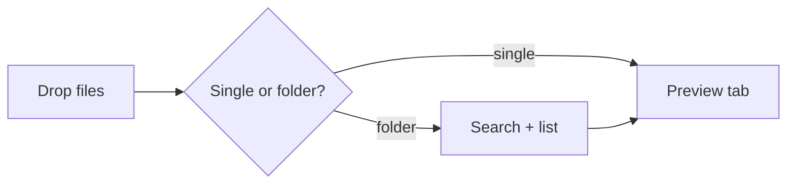

# Markdown Previewer — sample

A **quick** smoke-test doc: headings, lists, tables, code, a diagram, and an image.

- [x] GFM task list
- [ ] Search finds this line via "smoke"

| feature | status |
| ------- | ------ |
| tables  | ✅ |
| code    | ✅ |

> Blockquote renders with a left border.

```js
console.log('code fence');
```




_Last line to prove italics work._
